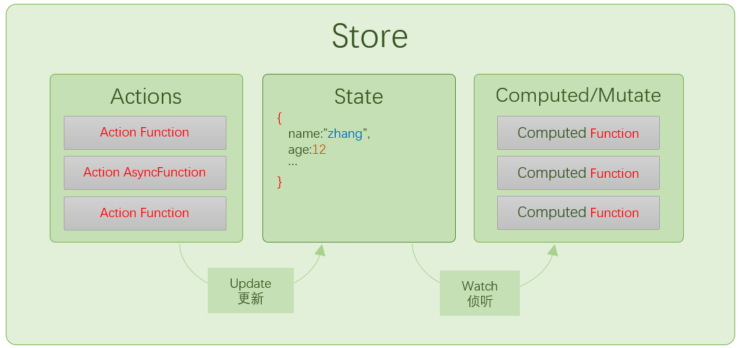

---
group:
  title: 基础
  order: 1 
title: Store
order: 1  
demo:
  tocDepth: 5
---

## 介绍

创建`AutoStore`时对应创建一个`Store`对象,就如同`Redux`中的`Store`一样,`Store`本质上就是受控的状态数据对象，当状态值变化时会触发事件，从而触发组件重新渲染。

当创建`Store`时会生成`AutoStore`对象，其结构如下：



 
## 创建

`@autostorejs/react`提供了`createStore`方法用来创建`Store`对象。

```ts 
const user = {
  firstName:"Zhang",
  lastName:"Fisher",
  age:18
}
 
const store = createStore({
  firstName:"Zhang",
  lastName:"Fisher",
  age:18
},{
  // ...配置参数
})

```

## 配置

`createStore`方法的第二个参数是配置，用来配置`Store`的行为。

```ts
export interface StoreOptions{    
    
}
```
