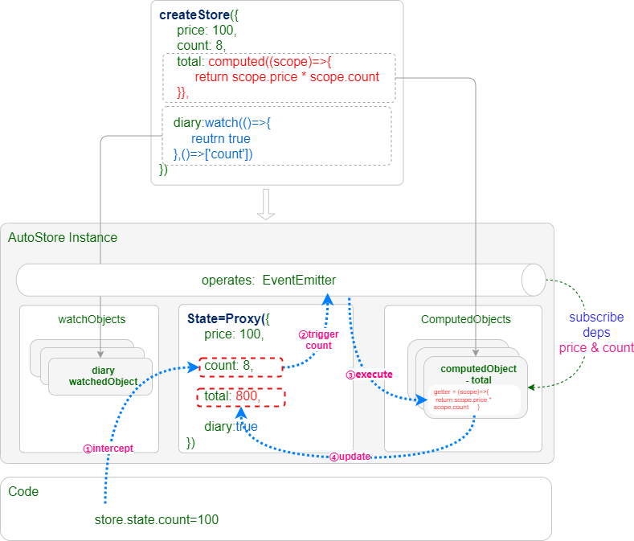

---
group:
  title: 计算属性
  order: 2
title: 关于
order: 0  
demo:
  tocDepth: 5
toc: content
---

# 关于

`AutoStore`提供了无与伦比的计算属性实现方式，支持同步计算属性和异步计算属性，具备丰富的计算重试、超时、加载中、错误等状态管理。

## 基本原理

:::success
**`AutoStore`实现了最独特的移花接木式的计算属性实现方式**，可以直接在状态中声明计算属性。
:::



**基本过程如下：**

1. 首先直接在`State`中声明计算属性函数，如`total=computed(scope)=>scope.price*scope.count`。
2. 调用`createStore`创建`AutoStore`时，会使用`Proxy`代理`State`对象，用来拦截对`State`对象的读写操作，建立一个状态变更的事件发布/订阅机制。
3. 然后在初始化时扫描整个`State`数据，如果是`函数`或者`ObserverDescriptorBuilder`对象（即`computed`和`watch`封装的函数），则会创建`ComputedObject`或`WatchObject`,然后根据依赖订阅事件。
3. `ComputedObject`会根据状态上下文和依赖收集，侦听状态变更事件。
3. 当`State`中的数据变化时，会自动触发计算属性的重新计算，将计算结果赋值给`State`中的对应属性。

在上图中，当`price`和`count`变化时，会自动触发`total`的重新计算，将计算结果赋值给`total`属性。这样，当我们访问`state.total`时,就是计算结果，而不是一个函数了。

**以上就是`@autostorejs/react`计算属性移花接木的过程原理**


## 同步计算

同步计算属性移花接木的过程如下：

```tsx | pure  
const state = {
  order:{
    price:10,
    count:1,
    total:computed((scope)=>{
      return scope.price*scope.count
    })
  }
}
```

此时的`total`就是一个普通函数,`typeof(state.total)==='function'`。

```tsx | pure  
const { state } = createStore({
  order:{
    price:10,
    count:1,
    total:computed((scope)=>{
      return scope.price*scope.count
    })
  }
})
```

经过`createStore`后，`state.total`就是一个普通数值，且`typeof(state.total)==='number'`。

`createStore`会根据状态上下文和`computed`函数创建一个`SyncComputedObject`对象,保存在`store.comnutedObjects`里面。


## 异步计算

异步计算属性移花接木的过程如下：

```tsx | pure  
const state = {
  order:{
    price:10,
    count:1,
    total:computed(async (scope)=>{
      return scope.price*scope.count
    },['./price','./count'])
  }
}
```

此时的`total`就是一个普通函数,`typeof(state.total)==='function'`。

```tsx | pure  
const { state } = createStore({
  order:{
    price:10,
    count:1,
    total:computed(async (scope)=>{
      return scope.price*scope.count
    },['./price','./count'])
  }
})
```
经过`createStore`后，`state.total`就是一个`AsyncComputedValue`，且`typeof(state.total)==='object`。

```ts | pure
state.total={
  value:10,
  loading:true,
  error:null,
  timeout:0,
  retry:0
  progress,
  run,
  cancel  
}
```

`createStore`会根据状态上下文和`computed`函数创建一个`AsyncComputedObject`对象,保存在`store.comnutedObjects`里面。

