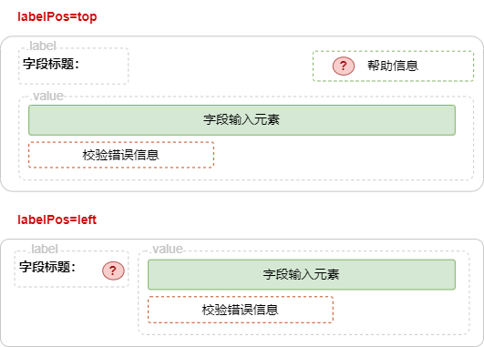

# 字段

## 关于

`AutoForm`的所有字段组件均是以`auto-field-`开头的`WebComponent`，用于渲染表单字段。

字段组件的`DOM`结构如下：



字段的`DOM`结构由以下几部份组成：

| 名称             | 描述                     |
| ---------------- | ------------------------ |
| **字段标题**     | 支持显示在`左侧`或`顶部` |
| **字段输入元素** | 支持各种输入字段元素     |
| **帮助信息**     | 额外的帮助信息           |
| **错误信息**     | 当校验出错时显示信息     |

## 指南

### 声明字段

在`AutoStore`状态使用`configurable`方法声明字段，

```ts
const store = new AutoStore({
    user: {
        username: configurable('NAME', {
            label: '用户名'，
            widget: 'input'  // [!code ++]
        })
    },
});
```

使用`configurable`声明状态中的某个状态值可配置时，可通过`widget`参数指定要渲染的字段组件类型。

**支持的字段组件**：

`captcha`,`checkbox-group`,`checkbox`,`color-picker`,`combine`,`custom`,`date`,`email`,`input`,`ipaddress`,`list`,`number`,`parts`,`password`,`phone`,`qrcode`,`radio-button`,`radio`,`range`,`rating`,`search`,`select`,`switch`,`textarea`,`time`,`tree-dropdown`,`tree-select`,`upload`,`url`,`verifycode`

### 字段帮助

字段可以通过`help`参数指定额外的帮助信息。

```ts
const store = new AutoStore({
    user: {
        username: configurable('NAME', {
            label: '用户名'，
            help: '请输入用户名' // [!code ++]
        }),
        password:configurable('', {
            label: '密码'，
            widget: 'password'，
            // 启用超链接
            help: '密码至少6位(https://zhangfisher.github.io/voerka-i18n/)' //  [!code ++]
        })
    },
});
```

**帮助信息可以在未尾`(<url>)`启用超链接**

<demo html="autoform/field/helppos.html"/>

### 通用字段属性

使用`configurable`函数声明一个状态的值可配置，即字段，可以传入多个字段属性。

```ts {3-5}
const store = new AutoStore({
    user: {
        username: configurable('<默认值>', {
            // ... 字段参数或属性
        }
    })
```

字段支持以下通用属性：

```ts
export type SchemaWidgetShareOptions<Value, State> = {
    name?: string;
    required?: boolean;
    visible?: boolean;
    enable?: boolean;
    description?: string;
    size?: string | number;
    icon?: string;
    // 用于验证
    invalidTips?: string | ((e: Error, path: string, newValue: Value, oldValue: Value) => string);
    onValidate?: (newValue: Value, oldValue: Value, path: string) => boolean;
    onFail?: 'pass' | 'throw' | 'ignore' | 'throw-pass';
    // 提供一些元数据
    label?: string;
    labelPos?: string;
    // 帮助信息可以增加一个链接，如"至少需要增加(http://www.baidu.com)"
    help?: string;
    placeholder?: string;
    group?: string;
    advanced?: boolean;
    order?: number;
    width?: number | string;
    height?: number | string;
    divider?: boolean; // 是否在前面显示一条分割线
    viewAlign?: 'left' | 'center' | 'right'; // viewonly模式下显示方式
    tips?: string;
    select?: (SchemaWidgetSelectItem<Value> | string | number)[];
    // 转换数据
    toView?: (value: any) => any;
    toState?: (value: any) => any;
    toInput?: (value: any) => any;
    toRender?: (value: any) => any;
    actions?: SchemaWidgetAction<State>[];
    // 用于扩展widget样式，如{"<选择器>":"样式"}
    styles?: SchemaWidgetStyles;
    // 用于扩展widget类，如{"<选择器>":"类名"}
    classs?: SchemaWidgetClasss;
};
```

### 字段宽度/高度

可以通过`width`和`height`参数指定字段宽度和高度。

<demo html="autoform/field/width.html"/>

:::warning 提示
当在一行中显示多个字段时，需要指定`height`参数以确保字段高度一致。
:::

### 自定义浏览视图

`toView`方法用于自定义浏览视图。

```ts {5-9}
const store = new AutoStore({
    user: {
        age: configurable(18, {
            label: '年龄'，
            toView: (value) => {
                return `<span
                style="color:red;border:1px solid red;padding:4px;">
                ${value}岁</span>`
            }
        })
    }
});
```

<demo html="autoform/field/toView.html"/>

### 必填字段

`required`参数用于指定字段是否必填。必填字段显示红色`*`号。

```ts
const store = new AutoStore({
    user: {
        name: configurable('', {
            label: '姓名'，
            required:true  // [!code ++]
        })
        password: configurable('', {
            label: '密码'，
            required:true  // [!code ++]
        })
    }
});
```

<demo html="autoform/field/required.html"/>

### 状态数据转换

`toInput`和`toState`方法用于状态数据和输入之间的转换。

-   `toInput`: 用于将`AutoStore`中的状态数据转换为输入数据用于渲染和编辑
-   `toState`: 用于将输入元素的数据转换为`AutoStore`中的状态数据

**例如：** 在下例状态中，sex 字段为`1`或`0`，在输入时，需要渲染为`男`或`女`，则可以如下配置：

```ts
const store = new AutoStore({
    user: {
        sex: configurable(0, {
            label: '性别'，
            toInput: (value) => {
                return value === 1 ? '男' : '女'
            },
            toState: (value) => {
                return value === '男' ? 1 : 0
            }
        })
    },
});
```

<demo html="autoform/field/toTransform.html"/>

### 样式控制

如果对字段的样式不满意，可以通过`styles`和`classs`参数进行样式控制。

-   **styles**

**类型**：`type SchemaWidgetStyles = Record<string, string | Record<string, string>>`

用于扩展字段`DOM`结构下的自定义样式，支持：

```ts
styles = {
    // <选择器>: <样式>
    '.label': 'color:red;border:1px solid red', // [!code ++]
};
// 或
styles = {
    '.label': {
        color: 'red',
        border: '1px solid red',
    },
};
```

:::warning 提示
使用 `CSS` 选择器时，`root`特指`AutoField`组件的`shadow`节点。
:::

-   **classs**

用于扩展字段的样式，如`{"<选择器>":"样式"}`

```ts
const store = new AutoStore({
    product: {
        name: configurable("voerkai18n", {
            label: '产品名称',
            styles:{
                '.label':'color:red;border:1px solid red' // [!code ++]
            }
        }),
        homepage:configurable("https://zhangfisher.github.io/voerka-i18n/", {
            label: '官网'，
            widget: 'url',
            styles:{
                'sl-input': {
                    border:'1px solid red'
                }
            }
        })
    },
});
```

<demo html="autoform/field/styles.html"/>

:::warning 提示

-   可以通过调试控制台查看字段的`DOM`结构，从而进行样式控制。
-   `styles`和`classs`的局限性在于无法选择控制字段组件内部的`WebComponent`元素，所有的样式控制都只能针对字段组件本身。

:::

### 字段联动

字段联动指的是字段之间相互影响。

**例如**：在 `IP`地址配置表单中，当启用 `DHCP` 时，IP 地址和子网掩码字段被禁用或隐藏，当禁用 `DHCP` 时，IP 地址和子网掩码字段必须填写。

字段联动的核心原理是基于`AutoStore`，当创建`AutoStore`实例时会扫描收集所有被`configurable`修饰的状态字段，并使用`AutoStore.shadow()`方法创建一个`Shadow AutoStore`对象，用于存储所有可配置数据。

**例如：**

```ts
const store = new AutoStore({
    user:{
        username:configurable('',{...}),
        password:configurable('',{...}),
        age:configurable(18,{...}),
        sex:configurable(1,{...}),
        vip:configurable(false,{...}),
    }
})
```

上述代码在创建`AutoStore`实例时，会同时收集状态树中所有被`configurable`修饰的状态字段，然后在内部创建一个`Shadow AutoStore`，

内部伪代码如下：

```ts
const shadowStore = new AutoStore({
    user_$_username:{...},
    user_$_password:{...},
    user_$_age:{...},
    user_$_sex:{...},
    user_$_vip:{...}
})
// 可以通过
store.schmeas.store===shadowStore

```

**重点**:

-   所有配置字段都会被收集起来创建`AutoStore`对象实例，这意味着配置参数可以是计算属性，如

```ts
 configurable('192.168.1.100', {
        label: 'IP地址,
        widget: 'ipaddress',
        enable: (state)=>!state.network.dhcp //[!code ++]
    }),
```

-   创建`Shadow AutoStore`对象实例和原`AutoStore`存在关联关系， 当原`AutoStore`中的状态字段发生变化时，`Shadow AutoStore`中的计算属性也会重新计算，并且触发字段组件的重新渲染。

**在下例中，`ip`字段和`mask`字段的显示和隐藏，`gateway`字段的启用和禁用，都是通过`Shadow AutoStore`对象实例中的计算属性来控制的。**

```ts
const store = new AutoStore({
        network: {
            dhcp: configurable(false, {
                label: '自动获取IP地址'
                widget: 'switch'
            }),
            ip: configurable('192.168.1.100', {
                label: 'IP地址,
                widget: 'ipaddress',
                enable: (state)=>!state.network.dhcp //[!code ++]
            }),
            mask: configurable('255.255.255.0', {
                label: '子网掩码',
                widget: 'ipaddress',
                visible: (state)=>!state.network.dhcp//[!code ++]
            }),
            gateway: configurable('192.168.1.1', {
                label: '默认网关',
                widget: 'ipaddress',
                enable: (state)=>!state.network.dhcp//[!code ++]
            }),
        },
    });
```

**`enable: (state)=>!state.network.dhcp`的作用就是创建一个计算属性，依赖于`state.network.dhcp`，当`state.network.dhcp`的值发生变化时，该计算属性会重新计算，从而触发字段组件的重新渲染。**

<demo html="autoform/field/ipconfig.html"/>

:::warning 提示
`configurable`函数的所有参数均可以是计算属性,并且计算属性的`scope`始终指向的状态根。
:::

### 响应式属性

默认情况下，`configurable`函数第 2 个参数用来配置字段属性。

```ts
configurable('192.168.1.100', {
    label: 'IP地址,
    widget: 'ipaddress',
    enable: true,
    ///.....字段属性
}
```

大部份字段属性均为可选参数，

并且除了`enable`, `required`, `visible`, `label`, `tips`, `icon`为响应式属性外，其余属性均为静态属性。

:::warning 提示
**Q**:什么样是响应式属性？

**A**:响应式属性是指当该属性的值发生变化时，**会触发字段组件的重新渲染**。
:::

可以通过`reactiveFields`来指定哪些属性是响应式属性。

```ts
configurable('192.168.1.100', {
    label: 'IP地址,
    widget: 'ipaddress',
    reactiveFields:['widget','prefix']
}
```
