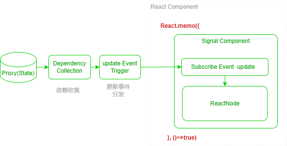

# 关于✨ 

## 什么是信号？


在主流的前端开发框架中，无论是`React`、`Vue`还是`Svelte`，核心都是围绕着更高效地进行`UI`渲染展开的。

为了实现高性能，基于DOM总是比较慢这个假设前提，其最核心的要解决的问题有两个：

- **响应式更新**
- **细粒度更新**

为了将`响应式更新`、`细粒度更新`优化到极致，各种框架是八仙过海，各显神通。以最流行的`React`和`Vue`为例， 

- 首先两者均引入了`Virtual DOM`的概念。
- `Vue`的静态模板编译，通过编译时的静态分析，来优化`细粒度更新`逻辑，在编译阶段尽可能地分析出该渲染的DOM。
- 而`React`使用`JSX`动态语法，本质上是一个函数，难以进行静态分析，所以`React`只能在运行时想办法。
  - 因此`React`就有了`Fiber`的概念，通过`Fiber`的调度来实现优化渲染逻辑，但是`Fiber`的调度逻辑很复杂，官方搞这玩意折腾了有一年。
  - 然后就是一堆的`React.memo`的优化手段，但是应用复杂时，驾驭起来也有**比较大的心智负担**。
  - 因此，官方又搞了个`React Compiler`，通过编译时的静态分析，来为代码自动添加`React.memo`逻辑，但这玩意从提出到现在怎么也有两年了，还在实验阶段。估计也是不太好搞。

由于`Virtual DOM`的特性，无论是`React`还是`Vue`，本质上都是在`Virtual DOM`上进行`diff`算法，然后再进行`patch`操作，差别就是`diff`算法的实现方式不同。

**但是无论怎么整， 在`Virtual DOM`的`diff`算法加持下，`状态的变化`总是难以精准地与`DOM`对应匹配。**

通俗说，就是当`state.xxx`更新时，不是直接找到使用`state.xxx`的`DOM`进行精准更新，而是通过`Virtual DOM`的`diff`算法比较算出需要更新的`DOM`元素，然后再进行`patch`操作。

问题是，这种`diff`算法比较复杂，需要进行各处优化，对开发者也有一定的心智负担，比如在在大型`React`应用中对`React.memo`的使用,或者在`Vue`中的模板优化等等。

:::warning 注意
-  Q: **为什么说在大型应用中使用`React.memo`是一种心智负担？**
-  A: 实际上`React.memo`的逻辑本身很简单，无论老手或小白均可以轻松掌握。但是在大型应用中，一方面组件的嵌套层级很深，组件之间的依赖关系很复杂，另外一方面，组件数量成百上千。如果都要使用`React.memo`来优化渲染，就是一种很大的心智负担。如果采用后期优化，则问题更加严重，往往需要使用一些性能分析工具才可以进行针对性的优化。简单地说，当应用复杂后，`React.memo`才会成为负担。
:::


因此框架的最核心的问题就是**能根据`状态的变化`快速找到依赖于该状态的`DOM`的进行重新渲染**，即所谓的`细粒度更新`。


即然基于`Virtual DOM`的`diff`算法在解决细粒度更新方面存在问题，那么是否可以不进行`diff`算法，直接找到`state.xxx`对应的`DOM`进行更新呢？ 

方法是有的，就是前端最红的`signal`的概念。

事实上`signal`概念很早就有了，但是自出了`Svelte`之类的框架，它不使用`Virtual DOM`，不需要`diff`算法，而是引入`signal`概念，可以在**信号触发时只更新变化的部分，真正的细粒度更新**，并且性能也非常好。

这一下子就把`React`和`Vue`之类的`Virtual DOM`玩家们给打蒙了，一时间`signal`成了前端开发的新宠。
所有的前端框架均在`signal`靠拢，`Svelte`和`solidjs`成了`signal`流派的代表，就连`Vue`也不能免俗，`Vue Vapor`就是`Vue`的`signal`实现（还没有发布）。


**那么什么是信号？**

引用卡颂老师关于`signal`的一篇文章[Signal:更多前端框架的选择](https://juejin.cn/post/7203266679602151482?searchId=20240927133705309C92B350C93291DBBA)。

卡颂老师说`signal的本质，是将对状态的引用以及对状态值的获取分离开。`

大神就是大神，一句话就把`signal`的本质说清楚了。但是也把我等普通人给说懵逼了，这个概念逼格太高太抽象了，果然是大神啊。

下面我们按凡人的思维来理一理`signal`，构建一套`signal`机制的基本流程原理如下：

- **第1步： 让状态数据可观察**

让状态数据变成`响应式`或者`可观察`，办法就是使用`Proxy`或者`Object.defineProperty`等方法，将状态数据变成一个`可观察`对象，而不是一个普通的数据对象。

`可观察`对象的作用就是**拦截对状态的访问**，当状态发生读写变化时，就可以收集依赖信息。

让数据可观察有多种方法，比如`mobx`就不是使用`Proxy`，而是使用`Class`的`get`属性来实现的。甚至你也可以用自己的一套`API`来实现。只不过现在普遍使用`Proxy`实现。核心原理就是要**拦截对状态的访问，从而收集依赖信息**。

:::warning 注意
让状态数据可观察的目的是为了感知状态数据的变化，这样才能进行下一步的响应。感知的颗粒度越细，就越能实现细粒度更新。
:::

- **第2步：信号发布/订阅**

由于可以通过**拦截对状态的访问**，因此，我们就可以知道什么时候读写状态了，那么我们就可以在读写状态时，发布一个`信号`，通知订阅者，状态发生了变化。

因此，我们就需要一个`信号发布/订阅`的机制，来登记什么信号发生了变化，以及谁订阅了这个信号。

您可以使用类似`mitt`、`EventEmitter`之类的库来构建`信号发布/订阅`，也可以自己写一个。
 
`信号发布/订阅`最核心的事实上就是一个订阅表，记录了谁订阅了什么信号，在前端就是哪个DOM渲染函数，依赖于哪个信号（状态变化）。

:::warning 提示
建立一个发布/订阅机制的目的是为了建立`渲染函数`与`状态数据`之间的映射关系，当态数据发生变化时，根据此来查询到依赖于该状态数据的`渲染函数`，然后执行这些`渲染函数`，从而实现`细粒度更新`。
:::


- **第3步：渲染函数**

接下来我们编写`DOM`的渲染函数，如下：

```js | pure
  function render() {
      element.textContent = countSignal.value.toString();
  }
```

在此渲染函数中：

- 我们直接更新`DOM`元素，没有任何的`diff`算法，也没有任何的`Virtual DOM`。
- 函数使用访问状态数据`count`来更新`DOM`元素，由于状态是**可观察的**，因此当执行`countSignal.value`时，我们就可以拦截到对`count`的访问，也就是说我们收集到了该`DOM`元素依赖于`count`状态数据。
- 有了这个`DOM Render`和`状态数据`的依赖关系，我们就可以在`signal`的信号发布/订阅机制中登记这个依赖关系.
 
:::info 
收集依赖的作用就是建立渲染函数与状态之间的关系。
:::

- **第4步：注册渲染函数**

最后我们将`render`函数注册到`signal`的订阅者列表中，当`count`状态数据发生变化时，我们就可以通知`render`函数，从而更新`DOM`元素。

 
## 简单示例

下面是一个简单的`signal`的示例，我们创建一个`signal`对象`countSignal`，并且创建一个`DOM`元素`countElement`，当`countSignal`发生变化时，我们更新`countElement`的`textContent`。

:::code-group

```js | pure
        class Signal<T> {
          private _value: T;
          private _subscribers: Array<(value: T) => void> = [];
          constructor(initialValue: T) {
              this._value = initialValue;
          }
          get value(): T {
              return this._value;
          }
          set value(newValue: T) {
              if (this._value !== newValue) {
                  this._value = newValue;
                  this.notifySubscribers();
              }
          }
          subscribe(callback: (value: T) => void): () => void {
              this._subscribers.push(callback);
              return () => {
                  this._subscribers = this._subscribers.filter(subscriber => subscriber !== callback);
              };
          }

          private notifySubscribers() {
              this._subscribers.forEach(callback => callback(this._value));
          }
      }

      const countSignal = new Signal<number>(0);
      const countElement = document.getElementById('count')!;
      const incrementButton = document.getElementById('increment')!;

      function render() {
          countElement.textContent = countSignal.value.toString();
      }
      function increment() {
          countSignal.value += 1;
      }
      countSignal.subscribe(render);
      incrementButton.addEventListener('click', increment);
      render(); 
```

```html
<h1>计数器: <span id="count">0</span></h1>
<button id="increment">增加</button>
```
:::


## 信号组件

**那么我们如何在`React`中使用`signal`呢？**

从上面我们可以知道，`signal`驱动的前端框架是完全不需要`Virtual DOM`的。

而本质上`React`并不是一个`Signal`框架，其渲染调度是基于`Virtual DOM`、`fiber`和`diff`算法的。

因此，`React`并不支持`signal`的概念，除排未来`React`像`Vue`一样升级`Vue Vapor mode`进行重大升级，抛弃`Virtual DOM`，否则在`React`在中是不能真正使用如同`solidjs`和`Svelte`的`signal`概念的。

但是无论是`Virtual DOM`还是`signal`，核心均是为了解决`细粒度更新`的问题，从而提高渲染性能。

因此，我们可以结合`React`的`React.memo`和`useMemo`等方法来模拟`signal`的概念，实现`细粒度更新`。

这样我们就有了**信号组件**的概念，其本质上是使用`React.memo`包裹的`ReactNode`组件，将渲染更新限制在较细的范围内。




- 核心是一套依赖收集和事件分发机制，用来感知状态变化，然后通过事件分发变化。
- 信号组件本质上就是一个普通的是React组件，但使用`React.memo(()=>{.....},()=>true)`进行包装，`diff`总是返回`true`,用来隔离`DOM`渲染范围。
- 然后在该信号组件内部会从状态分发中订阅所依赖的状态变化，当状态变化时重新渲染该组件。
- 由于`diff`总是返回`true`，因此重新渲染就被约束在了该组件内部，不会引起连锁反应，从而实现了`细粒度更新`。


以下是`AutoStore`中的`signal`的一个简单示例：


<demo react="signals/signalBase.tsx"/>

- 上例中，当更新`Age`时，渲染被限制在`信号组件`内部，不会引起连锁反应。


:::warning 注意
- 信号组件仅仅是模拟`signal`实现了`细粒度更新`，其本质上是使用`React.memo`包裹的`ReactNode`组件。
- 创建`$`来创建信号组件时，`$`是`signal`的快捷名称。因此上面的`{$('age')}`等价于`{signal("age")}`。
- 更多的`信号组件`的用法请参考[signal](../signal/component)。
:::


## 小结

由于`React`沉重的历史包袱，在可以预见的未来，`React`应该不会支持真正意义上的`signal`。

在卡颂老师`的[Signal:更多前端框架的选择](https://juejin.cn/post/7203266679602151482?searchId=20240927133705309C92B350C93291DBBA)中也提到，

**React团队成员对此的观点是：**

- 有可能引入类似`Signal`的原语
- `Signal`性能确实好，但不太符合`React`的理念


而`AutoStore`所支持的`信号组件`的概念，可以视为模拟`signal`或者类似`Signal`的原语，使得我们可以在`React`中实现`细粒度更新`，而不用再去纠结`React.memo`的使用。


:::info
自`React 19`开始,`React`官方推出`Compiler`，帮助用户解决`React.memo`的问题，减少用户的心智负担。但是其并不是为关于决细粒度更新的问题，而是优化提高`React`的性能。
本人对`Compiler`的使用并不是很看好，有待进一步研究。
:::

