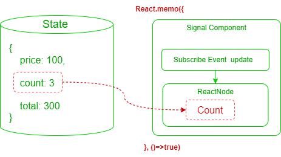
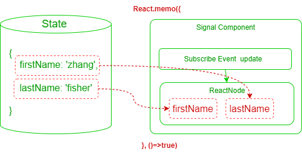
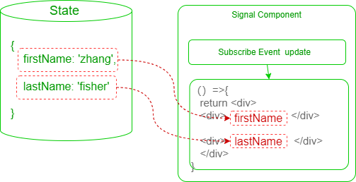
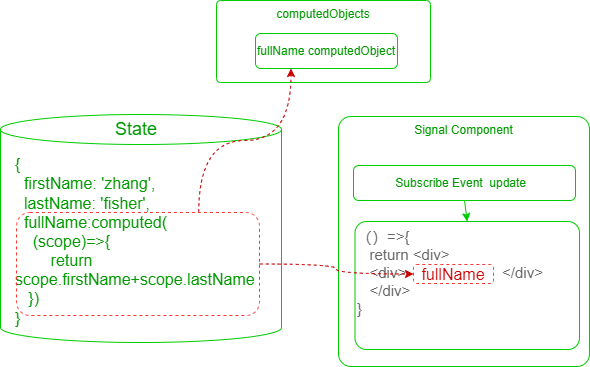
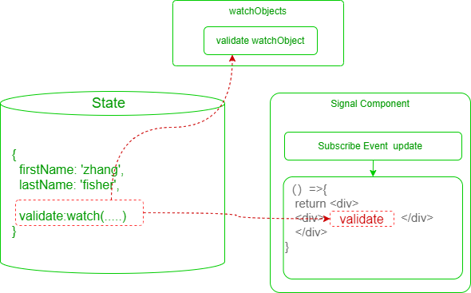

# 信号组件

## 关于

`AutoStore`可以使用`$`或`signal`来创建信号组件。
支持多种方式创建信号组件，创建信号组件的函数`$`或`signal`签名如下：

```ts
interface SignalComponentType<State extends Dict>{
    // 封装单个状态数据
    (selector: string,options?:SignalComponentOptions):React.ReactNode
    // 封装组合多个状态数据
    (selector: (state:ComputedState<State>)=>React.ReactNode,
        options?:SignalComponentOptions
    ):React.ReactNode
    // 自定义渲染函数
    <Value=any>(render:SignalComponentRender,
        path:string | string[],
        options?:SignalComponentOptions
    ):React.ReactNode
    // 自定义渲染函数,且动态创建计算属性
    <Value=any, Scope=any >(render:SignalComponentRender,
        getter:AsyncComputedGetter<Value,Scope>,
        options?:SignalComponentOptions
    ):React.ReactNode
    <Value=any, Scope=any >(render:SignalComponentRender,
        getter:ComputedGetter<Value,Scope>,
        options?:SignalComponentOptions
    ):React.ReactNode
    <Value=any, Scope=any >(render:SignalComponentRender,
        builder: ObserverDescriptorBuilder<string,Value,Scope>,
        options?:SignalComponentOptions
    ):React.ReactNode;
}
```

`AutoStore`支持非常灵活的信号组件创建方式。

## 封装单个状态

即将单个状态数据直接封装为信号组件，这是最简单的信号组件创建方式。




## 组合多个状态

即将多个状态数据组合创建为一个信号组件。




## 自定义渲染

提供自定义渲染函数，对状态数据进行更复杂的外观或样式控制。




## 动态计算信号组件

不需要预先在`State`中声明计算属性，动态创建计算属性，然后将计算属性对象（`computedObject`）封装为信号组件。



- 由于计算属性对象（`computedObject`）支持丰富特性，特别是异步计算属性，支持`retry`、`timeout`、`loading`、`error`等属性，因此可以让信号组件具有更加丰富的表现力功能。
- 使用`$(render,ObserverDescriptorBuilder)`方式将计算属性对象（`computedObject`）封装为信号组件。创建函数的签名如下：


```ts
<Value=any, Scope=any >(render:SignalComponentRender,
    getter:AsyncComputedGetter<Value,Scope>,
    options?:SignalComponentOptions
):React.ReactNode
<Value=any, Scope=any >(render:SignalComponentRender,
    getter:ComputedGetter<Value,Scope>,
    options?:SignalComponentOptions
):React.ReactNode
<Value=any, Scope=any >(render:SignalComponentRender,
    builder: ObserverDescriptorBuilder<string,Value,Scope>,
    options?:SignalComponentOptions
):React.ReactNode;
```

:::info 提醒
阅读前文[计算属性](../computed/about)章节，了解计算属性的基本概念。
:::

## 监听信号组件

即将监听属性对象（`watchObject`）封装为信号组件。



:::warning 提醒 
`watch`和`computed`均是`AutoStore`中的`ObserverObject`的子类，但是功能是不一样的。
阅读前文于[监听属性](../watch/about)章节，了解监听属性的基本概念。
:::

