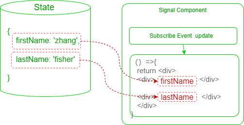

# 自定义渲染

## 介绍

前文将状态数据封装为信号组件的功能相对简单，因此也提供自定义渲染函数，可以在将状态数据封装为信号组件时进行更复杂的外观或样式控制，返回一个`ReactNode`类型的组件。



可以在将**状态数据直接直接封装为信号组件时指定自定义渲染函数**，方法函数签名如下：

```ts
interface SignalComponentType<State extends Dict>{
    <Value=any>(
      render:SignalComponentRender,    // 渲染函数
      path:string | string[],           // 状态数据路径,
      options?:SignalComponentOptions
    ):React.ReactNode 
}
```

自定义渲染函数`SignalComponentRender`的声明如下：

```ts
type SignalComponentRenderArgs<Value=any> = AsyncComputedValue<Value>
type SignalComponentRender<Value=any> =(
  value:SignalComponentRenderArgs<Value>
)=>React.ReactNode
```

**示例如下：**

```ts
$(
    // 渲染函数
    ({value,loading,timeout,retry,progress,error})=>{
      return <div>{value}</div>
    },
    // 状态数据的路径
    'user.age'
  )
```
如果是状态指向的是一个异步计算对象`AsyncComputedValue`，则会传入`loading`,`timeout`,`retry`,`progress`,`error`等参数，因此我们可以进行更多的渲染控制。


## 状态信号组件

前文中，我们使用`$('<状态路径>')`将**状态数据直接直接封装为信号组件**，但是缺少更多的控制，此时也可以指定一个自定义渲染函数。

```tsx 
<Value=any>(render:SignalComponentRender,path:string | string[]):React.ReactNode
```

将**状态数据直接直接封装为信号组件**指定自定义渲染函数的方式如下：

```ts  {3-5,7}
$(
    // 渲染函数
    ({value})=>{
      return <div>{value}</div>
    },
    // 状态数据的路径
    'user.age'
  )
```

以下是一个`$(render,'<状态路径>')`自定义渲染函数的示例：

<demo react="signals/signalCustomRender.tsx"/>


## 异步状态信号组件

如果状态数据路径所指向的是一个异步计算对象`AsyncComputedValue`时，该对象包含了`loading`、`error`、`value`等属性。

此时同样支持使用`$('<异步计算属性的路径>')`创建一个信号组件。
 
<demo react="signals/signalAsyncCustomRender.tsx"/>
 

:::warning 提醒
`$('order.count')`和`$('order.total.value')`是等价的，创建信号组件时，如果发现目标是`AsyncComputedValue`则自动添加`value`。
:::
 

## 高级异步信号组件

如果目标路径是一个异步计算属性，也采用同样的`$(<render>,<path>)`的方式自定义渲染，但此时渲染函数的参数是一个对象`AsyncComputedValue`，包含了`value`、`loading`、`error`、`timeout`、`retry`等属性。

因此，我们可以根据`loading`、`error`等属性进行更多的自定义渲染控制。

<demo react="signals/signalAsyncCustomRenderPro.tsx"/>
