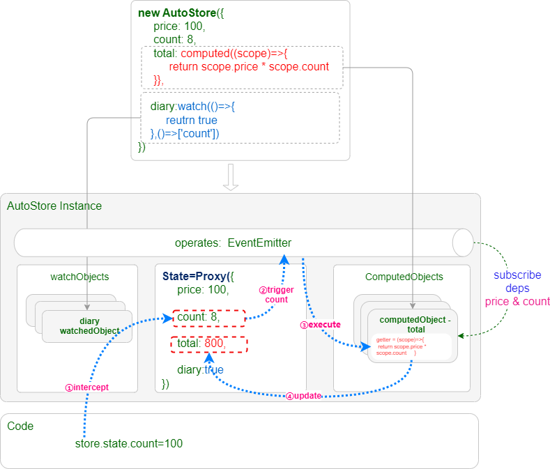

# 关于

`AutoStore`提供了无与伦比的计算属性实现方式，支持同步计算属性和异步计算属性，具备丰富的计算重试、超时、加载中、错误等状态管理。

## 基本原理

:::warning 提示
**`AutoStore`实现了最独特的移花接木式的计算属性实现方式**，可以直接在状态中声明计算属性。然后计算结果写入声明所在地。
:::



**工作流程如下：**

1. **声明计算属性**

在 `State` 中直接定义计算函数，例如：

```typescript
total: computed((scope) => scope.price * scope.count);
```

2. **创建响应式代理**

调用 `new AutoStore` 时，使用 `Proxy` 代理 `State` 对象，拦截所有读写操作，建立事件发布/订阅机制

3. **扫描并初始化**

遍历整个 `State` 数据：

- 遇到 `computed` 或 `watch` 封装的函数
- 创建对应的 `ComputedObject` 或 `WatchObject` 实例
- 根据依赖关系订阅相关事件

4. **建立响应式监听**

`ComputedObject` 自动监听所依赖状态的变化事件

5. **自动更新计算结果**

当依赖的数据变化时：- 自动触发计算函数重新执行 - 将计算结果赋值回 `state` 中的对应属性

:::tip 移花接木的妙处
在上图中，当 `price` 或 `count` 变化时，会自动触发 `total` 的重新计算，并将结果写入 `total` 属性。
这样，访问 `state.total` 时得到的是**计算结果值**（如 `number`），而不是**函数**本身！
:::

**以上就是`AutoStore`计算属性移花接木的过程原理**

## 同步计算

同步计算属性移花接木的过程如下：

```tsx
const state = {
    order: {
        price: 10,
        count: 1,
        total: computed((scope) => {
            return scope.price * scope.count;
        }),
    },
};
```

此时的`total`就是一个普通函数,`typeof(state.total)==='function'`。

```tsx
const { state } = new AutoStore({
    order: {
        price: 10,
        count: 1,
        total: computed((scope) => {
            return scope.price * scope.count;
        }),
    },
});
```

运行`new AutoStore`后会扫描整个对象，如果发现`computed`声明，则：

1. `new AutoStore`会根据状态上下文和`computed`函数创建一个`SyncComputedObject`对象,保存在`store.comnutedObjects`里面。
2. 运行一次同步计算函数收集依赖，然后将返回值写入`state.total`,此时`typeof(state.total)==='number'`。

## 异步计算

异步计算属性移花接木的过程如下：

```tsx
const state = {
    order: {
        price: 10,
        count: 1,
        total: computed(
            async (scope) => {
                return scope.price * scope.count;
            },
            ["./price", "./count"],
        ),
    },
};
```

此时的`total`就是一个普通函数,`typeof(state.total)==='function'`。

```tsx
const { state } = new AutoStore({
    order: {
        price: 10,
        count: 1,
        total: computed(
            async (scope) => {
                return scope.price * scope.count;
            },
            ["./price", "./count"],
        ),
    },
});
```

运行`new AutoStore`后会扫描整个对象，如果发现`computed`声明，则：

1. 根据`computed`声明结合状态上下文创建一个`AsyncComputedObject`对象,保存在`store.comnutedObjects`里面。
2. 将`state.total`替换成计算结果。
3. 异步计算还可以使用`asyncComputed`代替`computed`，创建功能更加强大的异步计算对象，此时`state.total`替换成`AsyncComputedValue`。

```ts
state.total={
  value:10,
  loading:true,
  error:null,
  timeout:0,
  retry:0
  progress,
  run,
  cancel
}
```

更多介绍请参考[异步计算](./async)。
