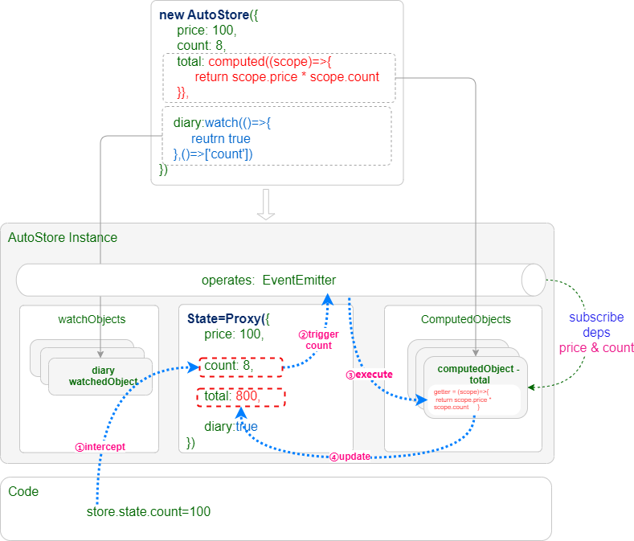
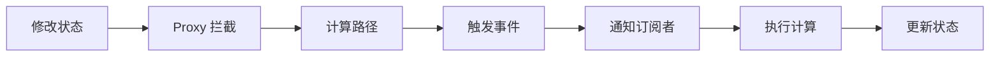

# 概念

使用 `AutoStore` 的第一步是创建一个 `AutoStore` 实例。这是整个状态管理系统的核心入口，所有功能都围绕它展开。

在开始使用之前，让我们先了解一下 `AutoStore` 的基本原理和工作机制。

## 对象结构

`AutoStore` 的核心架构如下图所示：



`AutoStore` 由四个核心部件组成：

| 核心部件 | 类型 | 说明 |
|---------|------|------|
| **`state`** | `Proxy` 对象 | 状态数据的代理对象，拦截所有读写操作 |
| **`computedObjects`** | `Map` | 存储所有计算属性（`ComputedObject`）的集合 |
| **`watchObjects`** | `Map` | 存储所有监听器（`WatchObject`）的集合 |
| **`operates`** | `EventEmitter` | 内部事件总线，订阅和发布状态变更事件 |

:::tip 事件机制说明
当对状态路径（如 `a.b.c`）进行读写操作时，会触发 `operates.emit('a.b.c')` 事件，通知所有订阅者。你可以通过 `operates.on('a.b.c')` 来订阅特定路径的变更。
:::

## 工作流程

### 构建阶段

创建 `AutoStore` 实例时的初始化流程：

1. **创建代理对象** - 创建 `Proxy` 对象来代理原始状态数据

2. **初始化事件系统** - 创建 `operates` 事件分发器（类似 `mitt`、`eventemitter2`）

3. **递归遍历状态树** - 根据数据类型创建相应的对象（支持 `lazy=true` 延迟创建）：

   | 数据类型 | 创建对象 | 存储位置 |
   |---------|---------|---------|
   | 普通对象或数组 | `Proxy` 对象 | 嵌入状态树 |
   | 计算函数 | `ComputedObject` | `store.computedObjects` |
   | 监听函数 | `WatchObject` | `store.watchObjects` |

4. **计算属性初始化** - 为计算属性建立依赖关系：

   - **同步计算函数**：执行一次函数，自动收集依赖
   - **异步计算函数**：需要手动指定依赖路径

   然后调用 `store.operates.on('依赖路径')` 订阅变更事件

:::info 计算函数 vs 监听函数
- **计算函数**：类似于 Vue 的 `computed`，根据确定的依赖计算派生值
- **监听函数**：类似于 Vue 的 `watch`，监听状态变化，支持动态范围的依赖
:::

### 更新阶段

当状态数据发生变化时，更新流程如下：



**详细步骤**：

1. **拦截操作** - 当执行 `store.state.count = 100` 时，`Proxy.set` 拦截该操作
2. **计算路径** - 计算出状态路径 `['count']`
3. **触发事件** - 调用 `operates.emit('count', operateParams)` 通知订阅者
4. **执行计算** - `ComputedObject` 收到通知后执行计算函数
5. **更新状态** - 将计算结果保存回 `store.state` 的对应路径

---

**示例代码**：

```typescript
import { AutoStore } from 'autostore';

const store = new AutoStore({
  count: 0,
  // 计算函数 - 自动收集依赖
  double: (scope) => scope.count * 2,
  // 监听函数 - 响应状态变化
  $watch: (scope) => console.log('count changed:', scope.count)
});

// 触发更新流程
store.state.count = 1; // double 自动更新为 2
```
