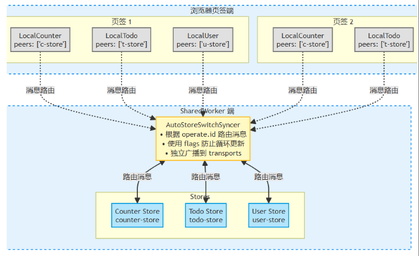

# AutoStoreSwitchSyncer

`AutoStoreSwitchSyncer` 是一个交换同步器，用于在 `SharedWorker` 中管理多个独立的 `AutoStore`，实现 与主线程之间的`N-N` 的状态同步。

## 架构说明



**工作流程：**

1. 页签创建本地 `store`（如 `counterStore`）
2. 使用 `peers` 选项指定要与 `SharedWorker` 中的哪个 `store` 同步
3. `SwitchSyncer` 根据 `operate.id` 自动路由消息到对应的 `store`
4. `Store` 变化后，广播到订阅了该`store` 的其他`store`

## 基本用法

### SharedWorker 服务端代码

```typescript
import { AutoStore } from "autostore";
import { AutoStoreSwitchSyncer, WorkerTransport } from "@autostorejs/syncer";

// 1. 创建多个独立的 store
const counterStore = new AutoStore(
    {
        count: 0,
        doubleCount: (scope: any) => scope.count * 2,
    },
    { id: "counter-store" },
);

const todoStore = new AutoStore(
    {
        todos: [] as Array<{ id: number; text: string; completed: boolean }>,
        totalCount: (scope: any) => scope.todos.length,
    },
    { id: "todo-store" },
);

const userStore = new AutoStore(
    {
        user: {
            name: "张三",
            age: 30,
            email: "zhangsan@example.com",
        },
    },
    { id: "user-store" },
);

// 2. 创建 SwitchSyncer
const switchSyncer = new AutoStoreSwitchSyncer([counterStore, todoStore, userStore], {
    autostart: true,
    debug: true, // 开启调试模式，会触发 remoteOperate 和 localOperate 事件
});

// 3. 监听事件（可选）
switchSyncer.on("remoteOperate", (operate) => {
    console.log("[SwitchSyncer] 收到远程操作:", operate);
});

switchSyncer.on("localOperate", (operate) => {
    console.log("[SwitchSyncer] 本地操作:", operate);
});

// 4. 监听来自页签的连接
self.addEventListener("connect", (event) => {
    const port = event.ports[0];
    port.start();

    // 5. 创建 transport
    const transport = new WorkerTransport({
        worker: port,
        autoConnect: true,
    });

    // 6. 监听 transport 连接事件
    transport.once("connect", () => {
        console.log("[MultiStore] Transport 已连接");
        // 将 transport 添加到 switchSyncer
        // 消息会自动路由到对应的 store
        switchSyncer.addTransport(transport);
    });

    // 7. 监听断开连接
    transport.on("disconnect", () => {
        console.log("[MultiStore] Transport 已断开");
        switchSyncer.removeTransport(transport.id);
    });
});

// 8. 可以直接操作任一 store，变化会自动广播
counterStore.state.count++; // 会同步到所有订阅了 counter-store 的客户端
```

### 客户端代码（React）

```typescript
import { useState, useEffect } from 'react';
import { AutoStore } from 'autostore';
import { AutoStoreWorkerSyncer } from '@autostorejs/syncer';

// 创建 SharedWorker
const worker = new SharedWorker('./shared-worker.ts', {
    type: 'module',
    name: 'multi-store',
});

// 创建本地 store
const counterStore = new AutoStore(
    {
        count: 0,
        doubleCount: (scope: any) => scope.count * 2,
    },
    { id: 'local-counter' }
);

const todoStore = new AutoStore(
    {
        todos: [] as Array<{ id: number; text: string; completed: boolean }>,
    },
    { id: 'local-todo' }
);

const userStore = new AutoStore(
    {
        user: { name: '张三', age: 30 },
    },
    { id: 'local-user' }
);

// 创建 syncer，使用 peers 选项指定要与 SharedWorker 中的哪个 store 同步
const counterSyncer = new AutoStoreWorkerSyncer(counterStore, worker, {
    peers: ['counter-store'],  // 只与 SharedWorker 中的 counter-store 同步
    mode: 'pull',
    immediate: true,
});

const todoSyncer = new AutoStoreWorkerSyncer(todoStore, worker, {
    peers: ['todo-store'],  // 只与 SharedWorker 中的 todo-store 同步
    mode: 'pull',
    immediate: true,
});

const userSyncer = new AutoStoreWorkerSyncer(userStore, worker, {
    peers: ['user-store'],  // 只与 SharedWorker 中的 user-store 同步
    mode: 'pull',
    immediate: true,
});

function App() {
    const [count, setCount] = useState(counterStore.state.count);
    const [todos, setTodos] = useState(todoStore.state.todos);
    const [user, setUser] = useState(userStore.state.user);

    useEffect(() => {
        // 监听 counterStore 变化
        const unwatch1 = counterStore.watch(({ path, value }) => {
            if (path[0] === 'count') {
                setCount(value);
            }
        });

        // 监听 todoStore 变化
        const unwatch2 = todoStore.watch(({ path }) => {
            if (path[0] === 'todos') {
                setTodos([...todoStore.state.todos]);
            }
        });

        // 监听 userStore 变化
        const unwatch3 = userStore.watch(({ path }) => {
            if (path[0] === 'user') {
                setUser({ ...userStore.state.user });
            }
        });

        return () => {
            unwatch1.off();
            unwatch2.off();
            unwatch3.off();
        };
    }, []);

    return (
        <div>
            <h1>计数器: {count}</h1>
            <button onClick={() => counterStore.state.count++}>+1</button>

            <h2>待办事项</h2>
            <ul>
                {todos.map(todo => (
                    <li key={todo.id}>{todo.text}</li>
                ))}
            </ul>

            <h2>用户信息</h2>
            <p>姓名: {user.name}, 年龄: {user.age}</p>
        </div>
    );
}
```

## 完整示例

参考 [packages/syncer/examples/worker-react/src/examples/multi-store](https://github.com/zhangfisher/autostore/tree/main/packages/syncer/examples/worker-react/src/examples/multi-store) 中的完整示例。
